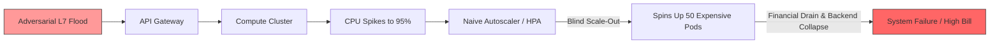
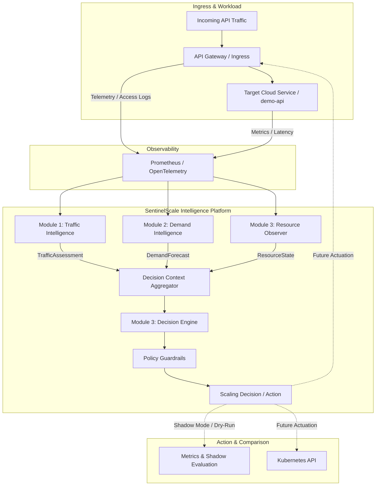
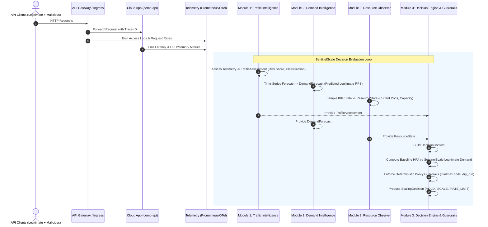
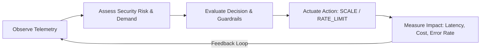

# SentinelScale Architecture

> **Security-Aware Resource Intelligence for Cloud APIs**

---

## 1. Problem Statement

Traditional cloud autoscaling mechanisms (such as Kubernetes Horizontal Pod Autoscaler - HPA) make scaling decisions reactively based on aggregate infrastructure utilization (CPU, memory) or raw request rates. 

When cloud APIs face malicious or adversarial traffic—such as Layer 7 Distributed Denial of Service (DDoS) floods, credential stuffing attacks, web scraping swarms, or automated bot bursts—standard autoscalers suffer from fundamental architectural flaws:
- **Resource Hijacking / Economic Denial of Sustainability (EDoS)**: Autoscalers blindly spin up new container replicas to service illegitimate or hostile traffic, incurring immense cloud infrastructure costs without serving real users.
- **Cascading Failure**: In many scenarios, scaling backend replicas exacerbates downstream database or third-party API bottlenecks.
- **Lack of Intent Awareness**: Infrastructure layers operate completely isolated from edge security and application-level demand signals.



---

## 2. System Objective

SentinelScale bridges the gap between **API traffic security intelligence**, **time-series demand forecasting**, and **cloud infrastructure scaling**. 

The system achieves:
1. **Security-Aware Capacity Planning**: Distinguishes legitimate customer demand from suspicious or malicious surges.
2. **Autonomous Protection & Optimization**: Scales infrastructure based *only* on legitimate demand while triggering gateway rate-limiting or mitigation for hostile bursts.
3. **Deterministic Safety Guardrails**: Prevents runaway flapping, honors strict min/max constraints, and isolates non-deterministic ML/heuristics from execution.
4. **Closed-Loop Feedback**: Continuously observes the outcome of infrastructure and traffic actions to refine future decisions.

---

## 3. Major Components Overview



---

## 4. Three Module Ownership Boundaries

The core platform is divided into three independently developed and owned services, communicating exclusively through versioned JSON Schema contracts:

| Module | Service Directory | Primary Responsibilities | Public Contract Output |
| :--- | :--- | :--- | :--- |
| **Module 1: Traffic Intelligence** | `services/traffic-intelligence` | Ingests traffic telemetry; extracts behavioral features; evaluates anomaly signals; calculates risk score, legitimacy score, and traffic classification. | `TrafficAssessment` (`contracts/traffic/traffic_assessment.schema.json`) |
| **Module 2: Demand Intelligence** | `services/demand-intelligence` | Historical time-series processing; extracts organic seasonality; forecasts predicted legitimate RPS and confidence intervals across future horizons. | `DemandForecast` (`contracts/demand/demand_forecast.schema.json`) |
| **Module 3: Platform & Decision Engine** | `services/platform` | Monitors Kubernetes cluster metrics and pod states; computes baseline HPA comparison; aggregates decision context; executes deterministic decision logic and policy guardrails. | `ResourceState`, `DecisionContext`, `ScalingDecision` |

---

## 5. End-to-End High-Level Data Flow



---

## 6. API Gateway & Telemetry Layer

- **Gateway Role**: The entry point for all API traffic. Attaches correlation tracing headers (`X-Request-ID`, `X-Trace-ID`) and exposes request timing.
- **Telemetry Aggregator**:
  - Prometheus scrapes `/metrics` endpoints across services every 5 seconds.
  - OpenTelemetry collector ingests spans and access logs for high-cardinality behavioral analytics.
- **Decoupling Guarantee**: Telemetry is scraped or streamed asynchronously. Upstream client requests never block on telemetry ingestion.

---

## 7. Module 1: Traffic Intelligence

### Future Architectural Responsibilities
- **Telemetry Ingestion**: Micro-batch processing of request rates, status codes, and header distributions.
- **Feature Extraction**: Burstiness coefficients, client IP entropy, user-agent entropy, endpoint dispersion ratios.
- **Anomaly Detection & Classification**: Machine learning models (XGBoost, Isolation Forests) predicting risk scores $[0.0, 1.0]$ and categorizing traffic into `legitimate`, `suspicious`, or `malicious`.
- **Explainability**: Outputs top explainability signals (e.g. `high_burst_rate`, `client_ip_concentration`).

### Bootstrap State
- Backed by an isolated mock generator in `app/mock/` tagged as `traffic-v0 (mock)`.
- Exposes `POST /api/v1/traffic/assess` returning deterministic, schema-compliant payloads.

---

## 8. Module 2: Demand Intelligence

### Future Architectural Responsibilities
- **Time-Series Decomposition**: Trends, weekly/daily seasonality, and organic promotional spikes.
- **Demand Forecasting**: Forecasting legitimate RPS across horizons (e.g. 5 minutes, 15 minutes, 1 hour) with prediction intervals (lower bound, upper bound, confidence).
- **Asynchronous Independence**: Operates independently without synchronous dependencies on Traffic Intelligence, ensuring high resilience.

### Bootstrap State
- Backed by isolated mock generator in `app/mock/` tagged as `demand-v0 (mock)`.
- Exposes `POST /api/v1/demand/forecast` returning deterministic, schema-compliant payloads.

---

## 9. Module 3: Resource Intelligence & Observer

- **State Observation**: Monitors running pods, desired replicas, pending pods, CPU/memory utilization, request throughput, and p95 latency.
- **Capacity Calculation**:
  $$\text{current\_capacity\_rps} = \text{running\_pods} \times \text{pod\_rps\_capacity}$$
  $$\text{estimated\_resource\_waste} = \max\left(0, \frac{\text{current\_capacity\_rps} - \text{predicted\_legitimate\_rps}}{\text{current\_capacity\_rps}}\right)$$
- Exposes `GET /api/v1/resources/current`.

---

## 10. Baseline HPA Comparison Architecture

SentinelScale evaluates every decision against a standard Kubernetes Horizontal Pod Autoscaler (HPA) baseline to quantify cost savings and overprovisioning prevention:

$$\text{baseline\_hpa\_pods} = \min\left(\text{max\_pods}, \max\left(\text{min\_pods}, \left\lceil \text{current\_pods} \times \frac{\text{current\_cpu\_utilization}}{\text{target\_cpu\_utilization}} \right\rceil\right)\right)$$

$$\text{pod\_delta\_vs\_baseline} = \text{sentinelscale\_recommended\_pods} - \text{baseline\_hpa\_pods}$$

When an attack occurs:
- **Baseline HPA**: Observes high CPU from attack traffic $\to$ Recommends scaling out from 4 pods to 12 pods.
- **SentinelScale**: Detects that legitimate demand is only 850 RPS $\to$ Recommends `HOLD` at 4 pods.
- **Result**: `pod_delta_vs_baseline = -8` (8 pods saved from wasteful overprovisioning).

---

## 11. Decision Engine & Deterministic Guardrails

### Strict Non-LLM Principle
Infrastructure decisions must be deterministic, auditable, and mathematically bounded. No Large Language Model (LLM) or non-deterministic agent is ever in the infrastructure actuation path.

```mermaid
flowchart TD
    Context[DecisionContext] --> Eval[Decision Engine Logic]
    Eval --> Check1{Traffic Risk >= 0.70 & Suspicious?}
    Check1 -- Yes --> CheckCap{Legitimate Demand <= Capacity?}
    CheckCap -- Yes --> ActionHold[Action: HOLD<br>Suppress Scale-out]
    CheckCap -- No --> ActionScale[Action: SCALE<br>Based on Legitimate Demand]
    Check1 -- No --> CheckDemand{Legitimate Demand > Capacity?}
    CheckDemand -- Yes --> ActionScale
    CheckDemand -- No --> ActionHoldNorm[Action: HOLD<br>Normal Operations]

    ActionHold --> Guardrails[Policy Guardrails]
    ActionScale --> Guardrails
    ActionHoldNorm --> Guardrails

    Guardrails --> Clamp[Clamp to [min_pods, max_pods]<br>Limit Step Surge to <= 2x]
    Clamp --> DryRun[Enforce dry_run = True]
    DryRun --> Out[Emitted ScalingDecision]
```

---

## 12. Safety Guardrail & Shadow Mode

1. **`dry_run: true`**: In this foundation phase, all decisions operate strictly in dry-run mode. No mutating calls are made to Kubernetes or the API Gateway.
2. **`shadow_mode: true`**: Decisions are logged alongside live cluster metrics to benchmark accuracy and resource savings over time.
3. **Step-Up Surge Protection**: Prevents scaling by more than 100% in a single decision cycle.
4. **Policy Clamping**: Replicas are strictly bounded by `min_pods` and `max_pods`.

---

## 13. Kubernetes Orchestration Architecture

All services deploy into the dedicated `sentinelscale` Kubernetes namespace:
- **`demo-api`**: Target workload generating business telemetry.
- **`traffic-intelligence`**: Module 1 deployment and ClusterIP service.
- **`demand-intelligence`**: Module 2 deployment and ClusterIP service.
- **`platform`**: Module 3 deployment and ClusterIP service.

Every manifest includes:
- Non-root container security context (`runAsNonRoot: true`, `runAsUser: 1000`)
- Explicit CPU/memory resource requests and limits
- HTTP Liveness and Readiness health probes

---

## 14. Closed-Loop Feedback Architecture

In future production iterations, SentinelScale forms a closed-loop feedback system:


