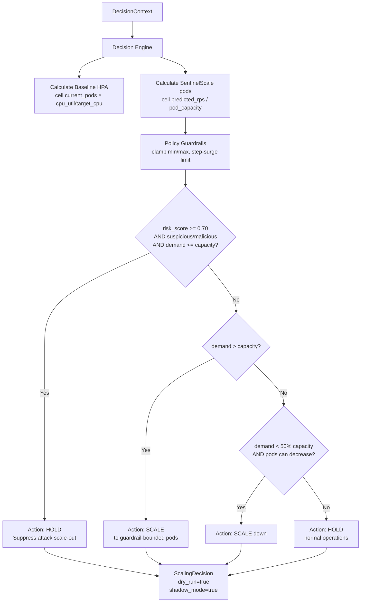

# Architecture — SentinelScale

> Last updated: 2026-09-05
> Source of truth: actual source code and verified tests in this repository

---

## 1. Overview

SentinelScale is a multi-microservice platform composed of three intelligence modules plus a target demo workload. All modules communicate exclusively through versioned HTTP/JSON Schema contracts enforced by Pydantic v2.

There is no shared cross-service database, no message broker, and no direct Python imports across service boundaries at runtime.

---

## 2. Component Map

```mermaid
graph TD
    subgraph Ingress
        Traffic[API Traffic] --> DemoAPI[demo-api :8000]
        DemoAPI --> Collector[Telemetry Collector]
    end

    subgraph Observability
        DemoAPI --> |"/metrics"| Prom[Prometheus :9090]
    end

    subgraph SentinelScale Closed-Loop Pipeline
        Collector --> |"TrafficTelemetryInput"| M1[Module 1: Traffic Intelligence :8001]
        M1 --> |"TrafficAssessment"| Accumulator[F2 Demand Accumulator (SQLite)]
        Accumulator --> |"DemandObservation[]"| M2[Module 2: Demand Intelligence :8002]

        Prom --> M3Obs[Module 3: Resource Observer]

        M1 --> |"TrafficAssessment"| M3Context[Decision Context Aggregator]
        M2 --> |"DemandForecast"| M3Context
        M3Obs --> |"ResourceState"| M3Context

        subgraph Module 3 - Platform :8003
            M3Context --> DE[Decision Engine]
            DE --> Guard[Policy Guardrails]
            Guard --> Decision[ScalingDecision]
            M3Context --> Evaluator[HPA vs SentinelScale Evaluator]
            Evaluator --> EvalResult[EvaluationResult]
        end
    end

    subgraph Output
        Decision --> |"dry_run=true shadow_mode=true"| Shadow[Shadow Evaluation / Logs]
        EvalResult --> |"pod_hours_saved divergence"| Metrics[Prometheus Metrics / Audit Store]
    end
```

---

## 3. Module Boundaries & Responsibilities

### Module 1: Traffic Intelligence (`services/traffic-intelligence/`)

**Responsibility**: Evaluates incoming API traffic telemetry and extracts behavioral features to assess security risk and derive legitimate vs. suspicious RPS estimates.

**Implementation**: `traffic-rules-v1`
- Analyzes burstiness ratios, client IP concentration ratios, non-standard User-Agent proportions, error rates, and endpoint dispersion.
- Categorizes traffic into `legitimate`, `suspicious`, or `malicious`.
- Computes `legitimate_rps_estimate`, `risk_score`, `legitimacy_score`, and `confidence`.

**Public Contract**: `TrafficAssessment` → [`contracts/traffic/traffic_assessment.schema.json`](contracts/traffic/traffic_assessment.schema.json)

---

### Module 2: Demand Intelligence (`services/demand-intelligence/`)

**Responsibility**: Forecasts future legitimate workload demand independently from security classifications using historical time-series demand observations.

**Implementation**: `demand-v1`
- Algorithm: **Recency-Weighted Moving Average + Linear Trend Projection**.
- Ingests chronological `DemandObservation[]` records derived from authenticated legitimate demand history.
- Produces bounded predictions: `lower_bound_rps <= predicted_legitimate_rps <= upper_bound_rps`.
- Calculates composite confidence based on sample count, coefficient of variation, sampling regularity, and forecast horizon.

**Public Contract**: `DemandForecast` → [`contracts/demand/demand_forecast.schema.json`](contracts/demand/demand_forecast.schema.json)

---

### Module 3: Platform, Resource Observer & Decision Engine (`services/platform/`)

**Responsibility**: Collects cluster resource telemetry, aggregates cross-module context, executes deterministic scaling policy rules, records audit logs, and computes comparative HPA evaluations.

**Internal Components Structure**:

```
services/platform/app/
├── api/v1/endpoints.py                 ← FastAPI routes (decision, evaluation, history, intelligence)
├── clients/
│   ├── traffic_client.py               ← HTTP client → Module 1 (:8001)
│   └── demand_client.py                ← HTTP client → Module 2 (:8002)
├── harness/
│   ├── generator.py                    ← AsyncTrafficGenerator
│   ├── collector.py                    ← TelemetryCollector
│   ├── models.py                       ← ScenarioDefinition & presets
│   └── runner.py                       ← ScenarioRunner
├── models/
│   ├── resource.py                     ← ResourceState
│   ├── context.py                      ← DecisionContext + PolicyOverrides
│   ├── decision.py                     ← ScalingDecision + ScalingAction enum
│   ├── evaluation.py                   ← EvaluationResult + EvaluationCategory enum
│   ├── history.py                      ← StoredObservation + HistoryStats
│   ├── intelligence.py                 ← HistoricalSummary + HistoricalTrends
│   ├── anomaly.py                      ← AnomalyAssessment + AnomalySignal
│   └── prediction.py                   ← PredictiveForecast
├── services/
│   ├── resource_observer.py            ← Delegates to telemetry providers
│   ├── baseline_hpa.py                 ← Standard reactive HPA formula
│   ├── decision_engine.py              ← Deterministic scaling logic
│   ├── policy_guardrail.py             ← Safety bounds enforcement
│   ├── context_aggregator.py           ← Multi-service orchestrator
│   ├── observation_scheduler.py        ← Continuous background observer
│   ├── history/
│   │   ├── base.py & sqlite_store.py   ← SQLite audit & observation store
│   │   └── demand_accumulator.py       ← F2 legitimate demand accumulator
│   ├── evaluation/
│   │   ├── base.py & evaluator.py      ← HPA vs SentinelScale evaluator
│   │   └── factory.py                  ← Singleton evaluator factory
│   ├── intelligence/
│   │   ├── historical.py               ← Statistical trend aggregations
│   │   ├── baseline.py & anomaly.py    ← Behavioral anomaly detection
│   │   └── predictive.py               ← OLS linear trend forecasting
│   ├── metrics/
│   │   └── prometheus.py               ← Pure-Python Prometheus exposition
│   └── telemetry/
│       ├── base.py & factory.py        ← ResourceTelemetryProvider ABC & factory
│       ├── mock_provider.py            ← MockTelemetryProvider (default)
│       ├── prometheus_provider.py      ← PrometheusTelemetryProvider
│       ├── kubernetes_provider.py      ← KubernetesTelemetryProvider
│       ├── hybrid_provider.py          ← Hybrid Prometheus + K8s aggregator
│       └── quantity_parser.py          ← Strict quantity parser
└── config/settings.py                  ← pydantic-settings configuration
```

**Public Contracts**: `ResourceState`, `DecisionContext`, `ScalingDecision` → `contracts/resources/`, `contracts/decisions/`

---

### Demo API (`demo-api/`)

**Responsibility**: Realistic target workload simulating an e-commerce cloud API. Exposes business endpoints (`/products`, `/users`) and Prometheus metrics (`/metrics`).

---

## 4. Telemetry Provider Architecture (Module 3)

The Resource Observer uses a pluggable provider pattern selected at startup via `TELEMETRY_PROVIDER` env var:

```
ResourceObserverService
      │
      ▼
ResourceTelemetryProvider (ABC)
   ├── MockTelemetryProvider        (TELEMETRY_PROVIDER=mock, DEFAULT)
   ├── PrometheusTelemetryProvider   (TELEMETRY_PROVIDER=prometheus)
   ├── KubernetesTelemetryProvider   (TELEMETRY_PROVIDER=kubernetes)
   └── HybridTelemetryProvider       (TELEMETRY_PROVIDER=hybrid)
```

All providers implement `fetch_resource_state(namespace, workload, trace_id) -> ResourceState` and raise `TelemetryProviderError` on failure (never silently return fake zero data).

---

## 5. Decision Engine Logic & Policy Guardrails



### Baseline HPA Formula
$$\text{baseline\_hpa\_pods} = \text{clamp}\left(\left\lceil \text{current\_pods} \times \frac{\text{cpu\_utilization}}{\text{target\_cpu\_utilization}} \right\rceil, \text{min\_pods}, \text{max\_pods}\right)$$

### SentinelScale Pod Formula
$$\text{raw\_sentinel\_pods} = \left\lceil \frac{\text{predicted\_legitimate\_rps}}{\text{pod\_rps\_capacity}} \right\rceil$$

### Policy Guardrail Enforcement (`default-safe-guardrail-v1`)
1. **Minimum pods**: `max(min_pods, raw_pods)` (default: 2)
2. **Maximum pods**: `min(max_pods, raw_pods)` (default: 20)
3. **Step-up surge protection**: `min(current_pods * 2, bounded_pods)`

---

## 6. Comparative HPA vs. SentinelScale Evaluator

The deterministic `DefaultHPAEvaluationService` compares the standard reactive HPA baseline against the SentinelScale decision:
- **`replica_delta = sentinelscale_pods - hpa_pods`**
- **`pod_hours_saved = max(0, hpa_pods - sentinelscale_pods)`**
- Categorizes comparisons into:
  - `ALIGNED`: Decisions agree on replica count.
  - `SENTINELSCALE_PREVENTS_UNNECESSARY_SCALE`: SentinelScale suppresses scale-out caused by attack traffic.
  - `SENTINELSCALE_PROACTIVELY_SCALES`: SentinelScale scales ahead of legitimate demand surges.
  - `SCALE_DOWN_DIFFERENCE`: SentinelScale safely scales down on low legitimate demand.
  - `UNCERTAIN`: Telemetry or forecasting confidence is below threshold ($< 0.50$).

---

## 7. Communication Protocols & Transport

| Boundary | Protocol | Serialization | Error Handling |
| :--- | :--- | :--- | :--- |
| Generator → Demo API | HTTP (async) | REST JSON | Per-request status & latency recording |
| Platform → Module 1 | HTTP POST | JSON (`TrafficTelemetryInput` → `TrafficAssessment`) | HTTP 422 / 502 error mapping |
| Platform (F2) → SQLite | In-process SQL | SQLite3 (WAL mode) | Parameterized queries & thread locking |
| Platform → Module 2 | HTTP POST | JSON (`ForecastRequest` → `DemandForecast`) | HTTP 422 / 502 / 503 mapping |
| Platform → Evaluator | In-process / HTTP | JSON (`DecisionContext` → `EvaluationResult`) | Deterministic calculation |
| Demo API → Prometheus | HTTP GET | Prometheus text format v0.0.4 | Scraped via `/metrics` |

---

## 8. Safety Guarantees

1. **`dry_run=True`** is hardcoded in `ScalingDecision` — scaling actions are purely advisory recommendations.
2. **`shadow_mode=True`** enables parallel evaluation alongside baseline HPA.
3. **`SENTINEL_AUTONOMOUS_ACTIONS_ENABLED=False`** guarantees no autonomous cloud mutations.
4. **Zero Kubernetes cluster mutations** were performed during all validation stages.
5. **Deterministic Execution**: Actuation decisions contain zero LLM or randomized heuristics.
