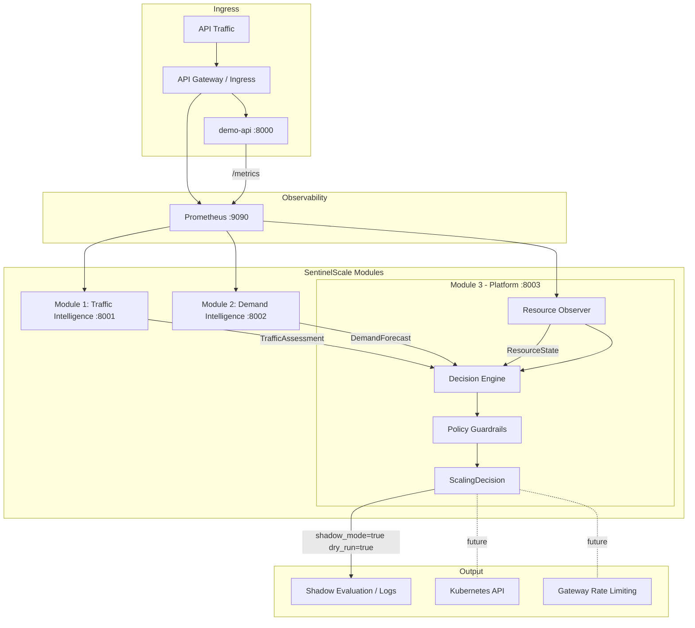
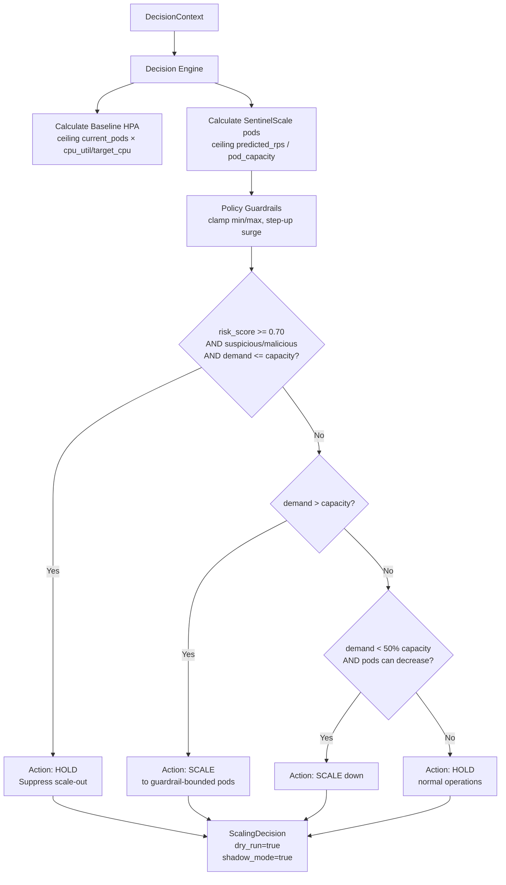

# Architecture — SentinelScale

> Last updated: 2026-09-01
> Source of truth: actual source code in this repository

---

## 1. Overview

SentinelScale is a multi-microservice platform composed of three intelligence modules plus a demo workload. All modules communicate exclusively through versioned JSON Schema contracts enforced by Pydantic v2. There is no shared database, no message broker, and no shared code between services.

---

## 2. Component Map



---

## 3. Module Boundaries & Responsibilities

### Module 1: Traffic Intelligence (`services/traffic-intelligence/`)

**Responsibility**: Ingests API traffic telemetry, scores security risk, classifies traffic.

**Current implementation state**: Mock (traffic-v0)
- `TrafficAssessmentService` delegates to `MockTrafficDataGenerator`
- Returns deterministic `TrafficAssessment` with fixed values: `risk_score=0.84`, `classification=suspicious`, `total_rps=2500`, `legitimate_rps_estimate=850`

**Future architectural responsibilities** (documented in ARCHITECTURE.md):
- Real telemetry ingestion: request rates, status codes, header distributions
- Feature extraction: burstiness coefficients, IP entropy, user-agent entropy
- ML classification: XGBoost / Isolation Forest risk scoring
- Explainability signals

**Public contract output**: `TrafficAssessment` → `contracts/traffic/traffic_assessment.schema.json`

---

### Module 2: Demand Intelligence (`services/demand-intelligence/`)

**Responsibility**: Independently forecasts future legitimate workload demand. Does NOT depend synchronously on Module 1.

**Current implementation state**: Mock (demand-v0)
- `DemandForecastingService` delegates to `MockDemandDataGenerator`
- Returns deterministic `DemandForecast` with fixed: `predicted_legitimate_rps=1200`, `confidence=0.91`

**Future architectural responsibilities** (documented in ARCHITECTURE.md):
- Time-series decomposition: trends, seasonality, promotional spikes
- Probabilistic forecasting with lower/upper bounds across multiple horizons
- Asynchronous operation — no runtime dependency on Module 1

**Public contract output**: `DemandForecast` → `contracts/demand/demand_forecast.schema.json`

---

### Module 3: Platform & Decision Engine (`services/platform/`)

**Responsibility**: Resource observation, baseline HPA computation, decision logic, policy guardrails.

**Current implementation state**: Production-grade telemetry providers implemented

**Internal components**:

```
services/platform/app/
├── api/v1/endpoints.py         ← FastAPI routes
├── clients/
│   ├── traffic_client.py       ← HTTP client → Module 1
│   └── demand_client.py        ← HTTP client → Module 2
├── models/
│   ├── resource.py             ← ResourceState
│   ├── context.py              ← DecisionContext + PolicyOverrides
│   ├── decision.py             ← ScalingDecision + ScalingAction enum
│   ├── traffic_contract.py     ← Mirror of Module 1 TrafficAssessment
│   └── demand_contract.py      ← Mirror of Module 2 DemandForecast
├── services/
│   ├── resource_observer.py    ← Delegates to telemetry provider
│   ├── baseline_hpa.py         ← HPA formula calculator
│   ├── decision_engine.py      ← Core decision logic
│   ├── policy_guardrail.py     ← Bounds enforcement
│   └── telemetry/
│       ├── base.py             ← ResourceTelemetryProvider (ABC)
│       ├── factory.py          ← get_telemetry_provider() factory
│       ├── mock_provider.py    ← MockTelemetryProvider (default)
│       ├── prometheus_provider.py ← PrometheusTelemetryProvider (Phase 1B)
│       ├── kubernetes_provider.py ← KubernetesTelemetryProvider (Phase 2A)
│       └── quantity_parser.py  ← Kubernetes quantity parsing
└── config/settings.py          ← All environment-based configuration
```

**Public contract outputs**: `ResourceState`, `ScalingDecision` → `contracts/resources/`, `contracts/decisions/`

---

### Demo API (`demo-api/`)

**Responsibility**: Realistic target workload simulating an e-commerce API. Generates authentic traffic patterns and Prometheus metrics for the platform to observe.

**Endpoints**: `/health`, `/ready`, `/version`, `/metrics` (Prometheus format), product/user endpoints via `v1_router`

**Prometheus metrics**: Emitted by `PrometheusMetricsMiddleware` in `app/metrics.py` — request counts, latency histograms, error rates, per-endpoint tracking.

---

## 4. Telemetry Provider Architecture (Module 3)

The Resource Observer uses a pluggable provider pattern selected at startup via `TELEMETRY_PROVIDER` env var:

```
ResourceObserverService
      │ (constructor injection or factory)
      ▼
ResourceTelemetryProvider (ABC)  ← base.py
   ├── MockTelemetryProvider      ← mock_provider.py    (TELEMETRY_PROVIDER=mock, DEFAULT)
   ├── PrometheusTelemetryProvider ← prometheus_provider.py  (TELEMETRY_PROVIDER=prometheus)
   └── KubernetesTelemetryProvider ← kubernetes_provider.py  (TELEMETRY_PROVIDER=kubernetes)
```

All providers must implement `fetch_resource_state(namespace, workload, trace_id) → ResourceState` and raise `TelemetryProviderError` on failure (never silently return fake data).

---

## 5. Decision Engine Logic



---

## 6. Baseline HPA Formula

$$\text{baseline\_hpa\_pods} = \text{clamp}\left(\left\lceil \text{current\_pods} \times \frac{\text{cpu\_utilization}}{\text{target\_cpu\_utilization}} \right\rceil, \text{min\_pods}, \text{max\_pods}\right)$$

$$\text{pod\_delta\_vs\_baseline} = \text{sentinelscale\_pods} - \text{baseline\_hpa\_pods}$$

A negative delta means SentinelScale saved that many pods from being wastefully provisioned.

---

## 7. Policy Guardrails (Deterministic)

Applied to raw recommended pod count in this order:

1. **Minimum pods**: `if bounded_pods < min_pods → return min_pods`
2. **Maximum pods**: `if bounded_pods > max_pods → return max_pods`
3. **Step-up surge protection**: `max_scale_per_cycle = current_pods * 2`

Policy name: `default-safe-guardrail-v1`

---

## 8. Kubernetes Infrastructure

All services deploy into the `sentinelscale` namespace:

```
infrastructure/kubernetes/
├── namespace.yaml
├── demo-api/           deployment.yaml, service.yaml
├── traffic-intelligence/
├── demand-intelligence/
└── platform/           deployment.yaml, service.yaml, rbac.yaml
```

Platform RBAC (`rbac.yaml`) grants **read-only** access to:
- `apps/deployments`: `get`
- `core/pods`: `get`, `list`

No write permissions to Kubernetes are granted.

---

## 9. Communication Patterns

| Communication | Protocol | Direction |
| :--- | :--- | :--- |
| Module 3 → Module 1 | HTTP POST (httpx async) | Pull on demand |
| Module 3 → Module 2 | HTTP POST (httpx async) | Pull on demand |
| Module 3 → Prometheus | HTTP GET (httpx async) | Pull on demand |
| Module 3 → Kubernetes API | HTTP GET (httpx async) | Pull on demand |
| Demo API → Prometheus | Scrape `/metrics` | Prometheus pulls |
| All modules | REST JSON | Stateless |

There is **no message queue, no event bus, no shared database** in the current implementation.

---

## 10. Important Design Decisions

See [`docs/DECISIONS.md`](DECISIONS.md) for full ADR records.

1. Three independent module architecture (ADR-001)
2. Decoupled Demand Intelligence — async, no runtime dependency on Module 1 (ADR-002)
3. Strictly deterministic, non-LLM decision guardrails (ADR-002)
4. Shadow mode + baseline HPA comparison first (ADR-003)
5. Pluggable telemetry provider with explicit failure representation (no silent zero-fallbacks)
6. `dry_run=True` hardcoded in `DecisionEngine.evaluate_decision()` — cannot be overridden at runtime
